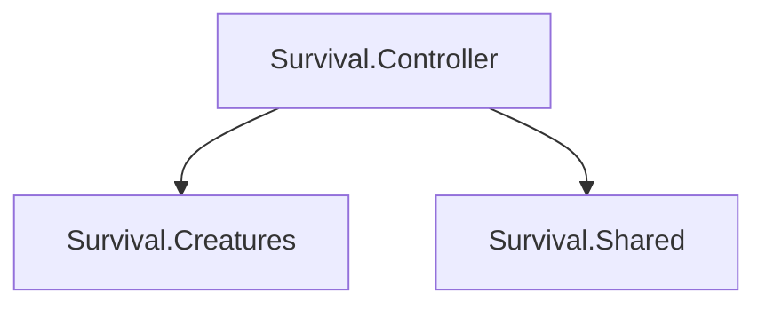

## 项目结构如下

项目脚本`Survival`

* AI -AI系统
* Building -建筑系统
* Controller -控制器系统
* Player -生物系统
* [Inventory](Survival/Inventory/Inventory.md) -仓库系统
* Debug -调试系统
* Editor -编辑器拓展
* [HUD](Survival/HUD/HUD.md) -UI系统
* Network -网路系统
* Physics -物理系统
* Shared -公共库
* Terrain -地形系统
* [Tweens](Survival/Tweens/Tweens.md) -动画库

公共脚本`Taxa`


## 引用关系



## Assembly Definition Reference

```C#
using Unity.Burst;
using Unity.Collections;
using Unity.Entities;
using Unity.Mathematics;
using Unity.NetCode;
using Unity.Physics;
```