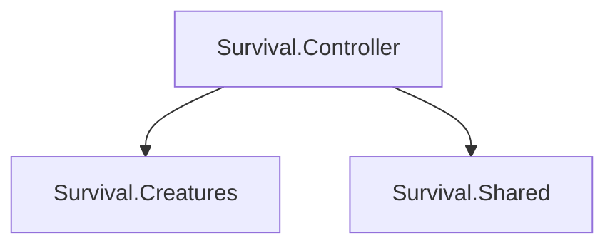

## 项目结构如下

* [AI]() -AI系统
* [Building]() -建筑系统
* [Controller]() -控制器系统
* [Creatures]() -生物系统
* [HUD]() -UI系统
* [Items]() -仓库
* [Network]() -网路系统
* [Physics]() -物理系统
* [Shared]() -公共库
* [Terrain]() -地形系统

## 引用关系



## Assembly Definition Reference

```C#
using Unity.Burst;
using Unity.Collections;
using Unity.Entities;
using Unity.Mathematics;
using Unity.NetCode;
using Unity.Physics;
```